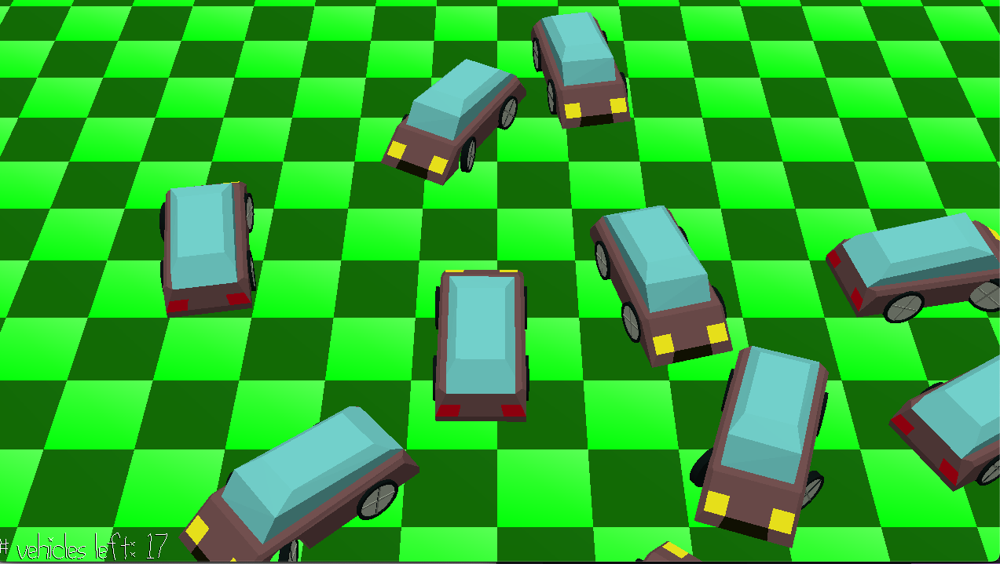

# Bow Pew Bow

Author: Gustavo Silvera

Design: There are cars that seem to enjoy bonking into each other randomly, making a low-ish "bow" sound. However one of them is unlike the others and instead makes a high-pitched "pew" sound on bonks. Find this unusual imposter by matching their unique sound cue with their visual bonking (when they get bonk'd or when they bonk), and then click on them to win! Click on anyone else and you lose!

Screen Shot:

How To Play:

Use WASD to move the camera viewpoint, but you cannot change the angle. Once you find the imposter-car (the one who *pew*s instead of *bow*s) then click on them with the mouse cursor to win! (clicking on anyone else will result in a loss!)

Notice that all the audio cues are spatial so you should be able to kinda locate the interesting vehicle if you pay attention to where the *pew* is coming from. 

Sources: 
- I created both the `bow.opus` and `pew.opus` sound effects by recording me saying these words in a funny pitch.

This game was built with [NEST](NEST.md).

